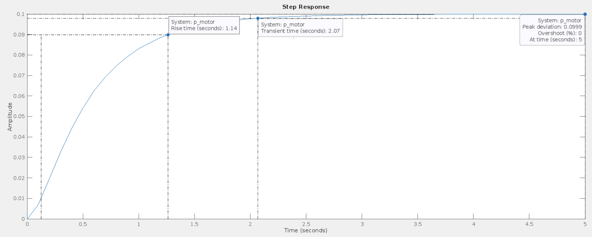
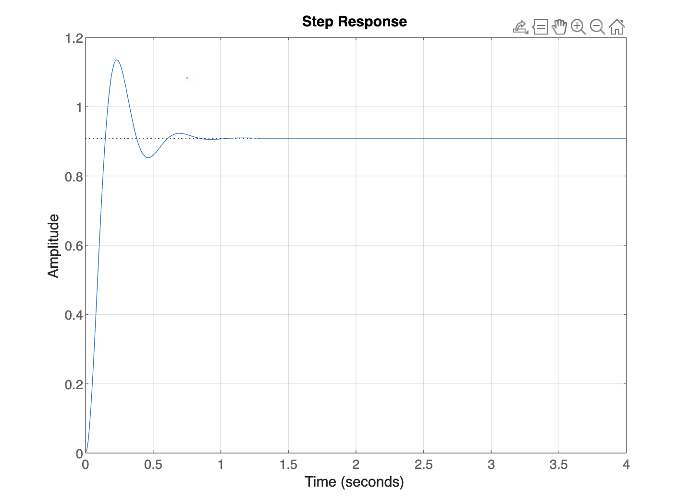
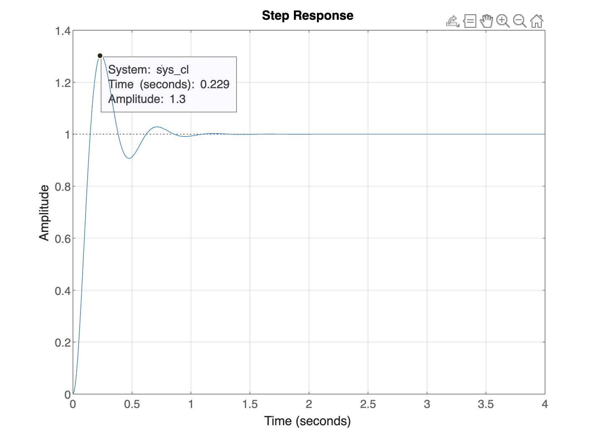
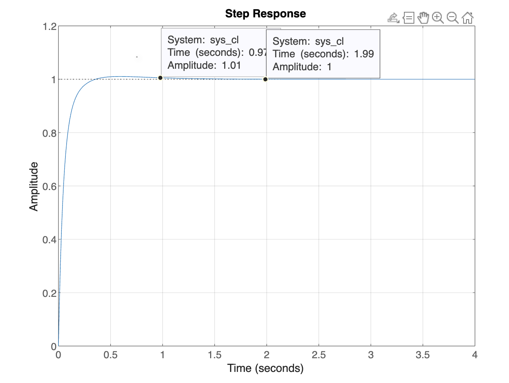

Tugas pertama mengenai sistem kendali Motor DC menggunakan PID pada MathLab



kode pertama tanpa dipengaruhi PID:

```
clear;
clc;

j = 0.01;
b = 0.1;
k = 0.01;
r = 1;
l = 0.5;
s = tf('s');

p_motor = k / ((j * s + b) * (l * s + r) + k^2);

ltiview('step', p_motor, 0:0.1:5);

```



Kp membuat hasil output lebih mendekati nilai yang diinginkan, akan tetapi masih memiliki error, overshoot, dan osilasi yang besar.

kode kedua mengenai Kp: 

```
clear;
clc;

J = 0.01;
b = 0.1;
K = 0.01;
R = 1;
L = 0.5;
s = tf('s');

P_motor = K / ((J * s + b) * (L * s + R) + K^2);

Kp = 100;

C = pid(Kp);
sys_cl = feedback(C * P_motor, 1);
step(sys_cl, 0:0.01:4)
grid

```



Ki dapat mengurangi nilai error, tetapi overshoot dan nilai osilasi yang dihasilkan jauh lebih tinggi.

kode ketiga mengenai Ki: 

```
clear;
clc;

J = 0.01;
b = 0.1;
K = 0.01;
R = 1;
L = 0.5;
s = tf('s');

P_motor = K / ((J * s + b) * (L * s + R) + K^2);

Kp = 100;
Ki = 200;

C = pid(Kp, Ki);
sys_cl = feedback(C * P_motor, 1);
step(sys_cl, 0:0.01:4)
grid

```



Kd dapat membuat nilai output yang stabil karena mampu untuk mengurangi overshoot dan osilasi, sehingga nilai output jauh lebih baik dan sesuai dengan yang diharapkan.

kode keempat mengenai Kd: 

```
clear;
clc;

J = 0.01;
b = 0.1;
K = 0.01;
R = 1;
L = 0.5;
s = tf('s');

P_motor = K / ((J * s + b) * (L * s + R) + K^2);

Kp = 100;
Ki = 200;
Kd = 10;

C = pid(Kp, Ki, Kd);
sys_cl = feedback(C * P_motor, 1);
step(sys_cl, 0:0.01:4)
grid
```

Kode program MATLAB di atas adalah implementasi dari sistem pengendalian untuk motor DC menggunakan kontrol PID (Proporsional, Integral, Derivative). Berikut adalah penjelasan mengenai setiap bagian dari kode tersebut:

Clear dan Clc: Perintah clear digunakan untuk menghapus semua variabel dari workspace MATLAB, sehingga workspace menjadi bersih. Perintah clc digunakan untuk membersihkan jendela command window MATLAB.

Parameter Motor DC: Baris-baris pertama mendefinisikan parameter-parameter fisik dari motor DC, yaitu:

J: Inertia motor (dalam satuan kg*m^2).
b: Koefisien gesekan viscous (dalam satuan Nms/rad).
K: Konstanta torsi-gaya EMF (dalam satuan N*m/A atau V/(rad/s)).
R: Resistansi motor (dalam satuan ohm).
L: Induktansi motor (dalam satuan Henry).

Fungsi Transfer Plant (P_motor): Baris selanjutnya mendefinisikan fungsi transfer dari motor DC tersebut menggunakan obyek transfer tf. Persamaan fungsi transfer P_motor dihitung berdasarkan parameter-parameter motor yang telah didefinisikan sebelumnya.

Parameter Kontrol PID: Kemudian, parameter untuk kontrol PID (Proporsional, Integral, Derivative) ditentukan. Ini mencakup:

Kp: Gain proporsional.
Ki: Gain integral.
Kd: Gain derivatif.
Pengendali PID (C): Fungsi pid digunakan untuk membuat obyek kontrol PID (C) dengan menggunakan parameter yang telah ditentukan sebelumnya.

Sistem Tertutup (sys_cl): Fungsi feedback digunakan untuk mendefinisikan sistem kontrol umpan balik tertutup dengan memasukkan pengendali PID (C) dan fungsi transfer motor (P_motor). Argument kedua (1) menunjukkan bahwa umpan balik dilakukan ke input sistem, sehingga kita memiliki sistem tertutup.

Respon Step dan Grid: Fungsi step digunakan untuk menggambar respons sistem terhadap sinyal langkah dengan mengambil sistem kontrol tertutup (sys_cl) sebagai argumen. Rentang waktu dari 0 hingga 4 detik didefinisikan sebagai vektor 0:0.01:4. Fungsi grid digunakan untuk menampilkan grid pada plot respons step.

Dengan menjalankan kode ini, Anda akan mendapatkan plot respons step dari sistem pengendalian motor DC yang diimplementasikan menggunakan kontrol PID dengan parameter-parameter yang telah ditentukan.

Bukti source code:


